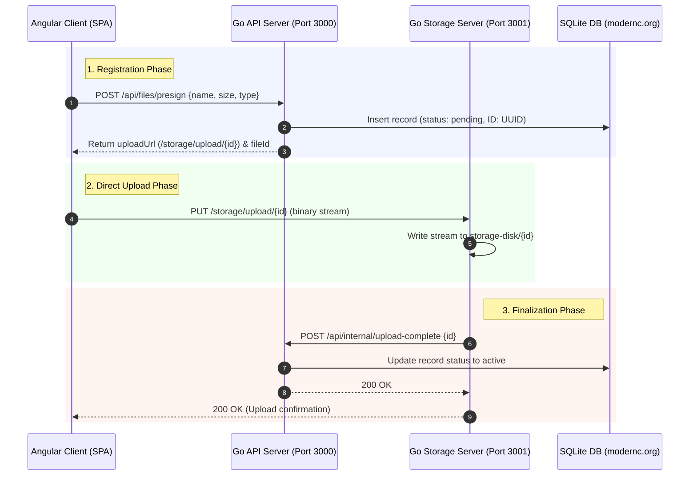

# S3-Style File Storage System

A high-performance, S3-style file storage system featuring a Go-based backend (composed of independent API and Storage servers), a modern Angular frontend, and a production-ready Kubernetes deployment configuration.

---

## 🏗️ System Architecture

The application adopts a **direct-upload (S3-style) architecture** to minimize memory consumption and optimize network bandwidth on the API gateway. Instead of buffering uploads in the API server, the frontend uploads raw binary streams directly to a dedicated Storage Server after obtaining a pre-signed identifier.

### Architecture Workflow



### Routing and Reverse Proxy
In a production deployment, **Nginx** serves as a reverse proxy, dispatching routes as follows:
- `/` ➡️ Static frontend assets (Angular SPA).
- `/api/*` ➡️ `backend-service:3000` (API Server).
- `/storage/*` ➡️ `backend-service:3001` (Storage Server with custom headers tuning, `client_max_body_size 10G`, and disabled request buffering).

---

## ✨ Features

- **S3 Path & Virtual Folder Simulation**: Group files into folders seamlessly using standard `/` delimiters (e.g. `Studio Work/Branding/logo.png`). Empty directories are registered using 0-byte directory placeholders (`application/x-directory`).
- **Drag-and-Drop Operations**: 
  - **Internal Moves**: Drag a file and drop it onto folder items or breadcrumb segments to move/rename.
  - **External Uploads**: Drag files from your desktop directly onto the explorer pane, specific folders, or breadcrumbs to upload them to that destination.
- **Queue-Based Upload Pipeline**: Manage active uploads with real-time progress percentages and cancel actions. Canceling active uploads halts network traffic and deletes partial records.
- **Global Search**: Search for files across all directories globally. Matches are rendered in a flat view with their relative virtual paths.
- **Dynamic File Operations**: Support for in-place inline renaming, deletion (recursive folder deletion for nested paths), and file downloads.
- **No external C-dependencies**: Uses a pure Go-based SQLite driver (`modernc.org/sqlite`), eliminating the need for `gcc` or CGO during compiling.

---

## 🛠️ Technology Stack

### Frontend
- **Framework**: Angular 21 (Signals, standalone components)
- **Styling**: Vanilla CSS with premium design details (dark mode interface, smooth hover transitions, glassmorphic accents)
- **Deployment Server**: Nginx

### Backend
- **Language**: Go
- **Database**: SQLite (managed via modern Cgo-free wrapper `modernc.org/sqlite`)
- **API Router**: Go standard library `http.NewServeMux` (leveraging Go 1.22+ method/path routing features)

### Infrastructure
- **Containerization**: Docker multi-stage builds
- **Orchestrator**: Kubernetes (Persistent Volumes, Deployments, Services)

---

## 📂 Project Structure

```text
.
├── backend/                  # Go Backend Microservices
│   ├── storage-disk/         # Local development physical upload folder (gitignored)
│   ├── main.go               # Entry point (spawns API and Storage servers)
│   ├── handlers.go           # HTTP handler functions for both servers
│   ├── db.go                 # SQLite initialization and query helper methods
│   ├── files.db              # SQLite development database (gitignored)
│   ├── go.mod                # Go module descriptor
│   └── Dockerfile            # Multi-stage production container build
├── frontend/                 # Angular Frontend SPA
│   ├── src/                  # Angular source code
│   │   ├── app/              # Root components, configs, and services
│   │   │   ├── app.ts        # Main application controller (drag-drop, uploads, state)
│   │   │   ├── app.html      # Glassmorphic explorer dashboard HTML
│   │   │   ├── app.css       # Premium layout styles and responsiveness rules
│   │   │   └── file.service.ts # HTTP API client wrapper
│   │   └── index.html        # SPA Index entry
│   ├── nginx.conf            # Nginx config for reverse proxying /api and /storage
│   ├── proxy.conf.json       # Dev proxy configuration (maps requests to ports 3000/3001)
│   ├── Dockerfile            # Node build & Nginx packaging container file
│   └── package.json          # Angular scripts and dependencies
├── k8s-deployment.yaml       # Kubernetes manifests (PV, Deployments, Services)
├── package.json              # Workspace root NPM helper commands
└── README.md                 # Project documentation
```

---

## 🚀 Getting Started (Local Development)

The workspace root provides a script to bootstrap both applications concurrently.

### Prerequisites
- [Node.js](https://nodejs.org/) (v18+)
- [Go](https://go.dev/) (v1.22+)

### Step-by-Step Launch
1. **Clone the repository** and open the root folder.
2. **Install frontend dependencies**:
   ```bash
   npm install
   ```
3. **Launch the entire stack**:
   ```bash
   npm run start
   ```
   *This commands triggers `npx concurrently` to execute:*
   - **Go Backend**: Runs `go run .` from `/backend`, launching the API Server on Port `3000` and the Storage Server on Port `3001`.
   - **Angular Frontend**: Runs `ng serve --proxy-config proxy.conf.json` from `/frontend` on Port `4200`.

Open your browser and navigate to **`http://localhost:4200`**.

---

## 🐳 Running on Kubernetes

The system comes equipped with ready-to-run Kubernetes configurations in [k8s-deployment.yaml](file:///Users/tengweihao/Projects/learning/file-storage-system/k8s-deployment.yaml).

### 1. Build Docker Images
Build the backend and frontend Docker containers:
```bash
# Build backend
cd backend
docker build -t file-storage-backend:latest .

# Build frontend
cd ../frontend
docker build -t file-storage-frontend:latest .
```

### 2. Deploy to Cluster
Apply the manifests to your Kubernetes environment (Minikube, Kind, or a cloud provider cluster):
```bash
cd ..
kubectl apply -f k8s-deployment.yaml
```

This manifest provisions:
- **Persistent Volume Claim (`file-storage-pvc`)**: Allocates `5Gi` of persistent disk space to store database entries (`files.db`) and uploaded binaries (`storage-disk/`).
- **Backend Deployment & Service**: Mounts the PVC to `/app/data` and exposes port `3000` (API) and port `3001` (Storage) via a ClusterIP service.
- **Frontend Deployment & Service**: Boots Nginx hosting the built SPA assets and exposes it externally via a `LoadBalancer` service on Port `80`.

---

## 📡 API Documentation

Below is a summary of the routes exposed by the Go backend.

### API Server (`Port 3000`)
| Method | Endpoint | Description | Request Body | Response Body |
|---|---|---|---|---|
| **GET** | `/api/files` | Lists all active files | *None* | `[]FileRecord` |
| **POST** | `/api/files/presign` | Register a new upload intention | `{ "name": string, "size": int64, "type": string }` | `{ "uploadUrl": "/storage/upload/...", "fileId": string }` |
| **POST** | `/api/files/rename` | Rename an existing file or virtual path | `{ "id": string, "name": string }` | `FileRecord` |
| **DELETE** | `/api/files/{id}` | Delete a file from disk and database | *None* | `{ "success": true }` |
| **POST** | `/api/internal/upload-complete` | Internal: Finalize file status as active | `{ "id": string }` | `{ "success": true }` |

### Storage Server (`Port 3001`)
| Method | Endpoint | Description | Headers | Request Body |
|---|---|---|---|---|
| **PUT** | `/storage/upload/{id}` | Stream file data directly to disk | `Content-Type` matching file | Raw binary stream |
| **GET** | `/storage/download/{id}` | Download a file from disk | *None* | *None (Serves file binary attachment)* |
